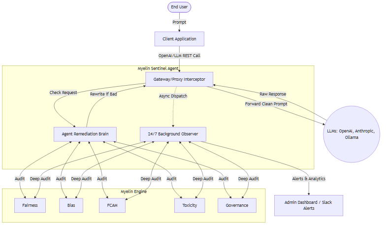
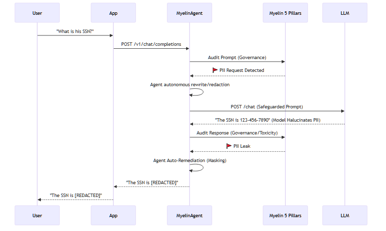

# MYELIN Sentinel: Transitioning from Middleware to a 24/7 Autonomous Governance Agent

## 1. Complete Analysis of Current Myelin State 
**What Myelin Does Today:**
Currently, Myelin serves as a robust **AI Governance Middleware.** It evaluates AI inputs and outputs via a synchronous FastAPI interface combining five pillars:
1. **Fairness:** Ensures ML models aren't discriminating based on sensitive attributes.
2. **Bias:** Detects systemic prejudices (gender, occupational, racial) in plain text.
3. **FCAM (Factual Consistency & Accountability):** Identifies hallucinations and ensures LLM outputs align with ground truth sources.
4. **Toxicity:** Scans for abusive, hateful, or harmful speech.
5. **Governance:** Prevents PII leaks (e.g., SSN, credit cards) and enforces corporate policies.

**Current Limitations (The "Why" for an Agent):**
- **Siloed Integration:** Developers must explicitly write code (`requests.post`) to call Myelin API during their LLM request lifecycle.
- **Latency Overhead:** Re-routing responses through a synchronous `/audit/conversation` endpoint blocks the user experience.
- **Passive Paradigm:** It acts as a judge, but it doesn't **fix** the problems. A developer has to handle what to do if the score is bad.

---

## 2. The Vision: Myelin Sentinel (24/7 Background Agent)
We will convert Myelin into **Myelin Sentinel**, a continuous, 24/7 background agent that any startup or developer can deploy with zero-to-no code changes.

Instead of waiting to be called, **Myelin Sentinel** will proactively monitor, intercept, and even *auto-correct* AI behavior. It will run in two modes simultaneously:

1. **Inline Proxy Agent (Real-Time Auto-Remediation):** Sits as a transparent gateway between the customer's App and the LLM (OpenAI/Ollama). It actively redacts PII or rephrases toxic responses *before* they reach the user.
2. **Asynchronous Observer Loop (24/7 Background Worker):** Sweeps database logs, Kafka streams, or App events in the background, continuously running the 5-pillars across the entirety of a company's LLM ecosystem, triggering alerts if a model drifts into bias or hallucinates at scale.

---

## 3. Architecture Diagrams

### High-Level System Architecture


### Flow Diagram: Real-time Auto-Remediation (The Agent at work)


---

## 4. Implementation Steps: The 5-Day Execution Plan

We have 5 days to turn this into a reality. Here is the strict timeline and breakdown:

### Day 1: The Proxy & Interceptor Layer Structure
- **Objective:** Build a drop-in API Gateway proxy that mimics the OpenAI API format.
- **Action:** 
  - Wrap the current FastAPI server into a `v1/chat/completions` proxy.
  - Make it so the user only changes their target URL from `https://api.openai.com` to `http://localhost:8000/v1` and injects `MYELIN_AGENT_KEY`.
  - Pass the requests smoothly to the real LLM and stream the response back.

### Day 2: Hooking the 5 Pillars (Inline Evaluation)
- **Objective:** Connect the existing Myelin orchestrator directly to the Proxy.
- **Action:**
  - Inject the 5 pillars into the middleware pipeline.
  - Implement concurrent processing (using `asyncio.gather` like current `api_server_all_pillars.py`).
  - Introduce configurable `strictness_level` per API key to allow fast skipping of slow rules if low latency is required.

### Day 3: Autonomous Remediation (The "Agentic" Behavior)
- **Objective:** The system must not just *block*, it must *fix*.
- **Action:**
  - Use a hyper-fast local model (or regex fallbacks) within the Agent.
  - If `<Governance>` flags PII, the Agent automatically replaces it with `[REDACTED]`.
  - If `<FCAM>` flags a hallucination, the Agent triggers a "Self-Correction Loop" requesting the LLM to verify and re-answer using the actual context.

### Day 4: The 24/7 Background Worker (Asynchronous Observer)
- **Objective:** Set up the 24/7 "Background Brain".
- **Action:**
  - Integrate **Celery** and **Redis** (or background tasks using `asyncio`).
  - Add an endpoint where companies can push logs in bulk.
  - Build a tailing mechanism that reads standard LLM observability logs (e.g., from Langfuse or standard JSON files) and runs deep audits out-of-line without zero user-facing latency.
  - Build webhook alerts (e.g., sending a Slack message: `"⚠️ Toxicity spike detected in prompt stream! 15 violations in last hour."`)

### Day 5: Packaging & Developer Experience (Zero-code)
- **Objective:** Make it extremely easy for a startup or developer to launch.
- **Action:**
  - Create a cohesive `docker-compose.yml` that boots the Redis worker, Proxy Agent, and the API Orchestrator.
  - Write a pip package `pip install myelin-agent` that developers can import as a 1-liner decorator.
  - Final end-to-end testing of the 100 rules in the real-time loop.

---

## 5. Example Code

### Example 1: The Gateway Proxy Agent (FastAPI)
*This acts as a drop-in replacing OpenAI/Ollama, providing zero-code integration.*

```python
from fastapi import FastAPI, Request
from myelin.orchestrator import audit_conversation
import httpx

app = FastAPI()

TARGET_LLM_URL = "https://api.openai.com/v1/chat/completions"

@app.post("/v1/chat/completions")
async def myelin_agent_proxy(request: Request):
    payload = await request.json()
    user_prompt = payload["messages"][-1]["content"]

    # 1. PRE-AUDIT OVER PROMPT (Agentic Defense)
    prompt_audit = await audit_conversation(user_prompt, bot_response="")
    if prompt_audit["overall"]["decision"] == "BLOCK":
        return {"error": "Prompt blocked by Myelin Agent due to violation."}

    # 2. RUN REAL LLM CALL (Pass-through)
    async with httpx.AsyncClient() as client:
        llm_resp = await client.post(TARGET_LLM_URL, json=payload, headers=request.headers)
    
    llm_data = llm_resp.json()
    bot_response = llm_data["choices"][0]["message"]["content"]

    # 3. POST-AUDIT OVER RESPONSE
    response_audit = await audit_conversation(user_prompt, bot_response=bot_response)
    
    # 4. AGENTIC AUTO-REMEDIATION
    if response_audit["overall"]["decision"] == "BLOCK":
        # The Agent actively corrects the issue instead of just failing
        if "governance" in response_audit["failed_pillars"]:
            bot_response = "[REDACTED BY MYELIN GOVERNANCE - PII DETECTED]"
        elif "factual" in response_audit["failed_pillars"]:
            bot_response = "I encountered a factual inconsistency in my reasoning. Please verify manually."
    
    llm_data["choices"][0]["message"]["content"] = bot_response
    return llm_data
```

### Example 2: The 24/7 Background Consumer Agent (Celery/Redis)
*This runs perpetually, processing message queues of conversations.*

```python
from celery import Celery
import time
from myelin.orchestrator import audit_conversation

# Setup Celery to run 24/7 in the background
app = Celery('myelin_background_agent', broker='redis://localhost:6379/0')

@app.task
def audit_conversation_async(conversation_id, user_msg, bot_msg, source_doc):
    """
    This task is picked up by the 24/7 worker. 
    It runs the heavyweight 100-rule Myelin check without blocking the user.
    """
    
    # Heavy computation here
    result = audit_conversation(user_msg, bot_msg, source_text=source_doc)
    
    # Proactive Alerting
    if result["overall"]["risk_level"] == "HIGH":
        trigger_slack_alert(f"🚨 HIGH RISK DETECTED in Conv {conversation_id}: {result['overall']['risk_factors']}")
        update_database_flag(conversation_id, flagged=True)
        
    return "Audit Complete"

def trigger_slack_alert(message):
    # Webhook integration for the startup/dev team
    pass
```

### Example 3: Minimal Developer Integration (The Startup view)
With Myelin Sentinel deployed, the developer just changes 1 line of code on their end:
```python
# Old Code:
# client = OpenAI(api_key="sk-openai-key")

# New Code (Using Myelin Agent Gateway):
client = OpenAI(
    api_key="sk-openai-key",
    base_url="http://localhost:8000/v1", # Routes through Myelin
    default_headers={"x-myelin-agent-key": "myelin_live_123"}
)

# Call works as normal, but is automatically governed & corrected 24/7
response = client.chat.completions.create(
    model="gpt-4",
    messages=[{"role": "user", "content": "What is the SSN of Employee 5?"}]
)
print(response.choices[0].message.content) # Output: "[REDACTED BY MYELIN AGENT]" 
```
---

## 6. Next Steps & Summary

## 7. Agent Email Alerts (Implemented)

Myelin Sentinel now supports conditional email notifications in agent mode:

- Trigger point: inline proxy audits inside `POST /v1/chat/completions`.
- Condition: email is sent only when a prompt or response audit raises flags.
- Attachment: flagged JSON audit report is converted to PDF and attached.
- Recipient resolution:
  - Preferred: verified user email resolved from backend API key.
  - Optional fallback: request email header or static env email (off by default).

This keeps agent behavior aligned with API behavior for notification policy.

To achieve this in 5 days:
1. **Initialize the Agent Wrapper codebase** alongside the existing `orchestrator` folder.
2. **Setup LiteLLM or direct FastAPI routing** to handle proxying OpenAI/Anthropic/Ollama request shapes seamlessly.
3. Use the **existing `app.state` architecture** in `api_server_all_pillars.py` to ensure the rules (Fairness, Toxicity, BIAS, FCAM, Governance) are pre-loaded in memory for ultra-fast inference.
4. Establish the **Redis + Celery stack** for the 24/7 background queue.
5. Combine everything in a **Docker Compose** network, providing startups a single `docker-compose up -d` command to run the entire backend governance agent seamlessly.

This transition re-architects Myelin from just a passive "auditor" to a **proactive, 24/7 active defense mechanism**.
