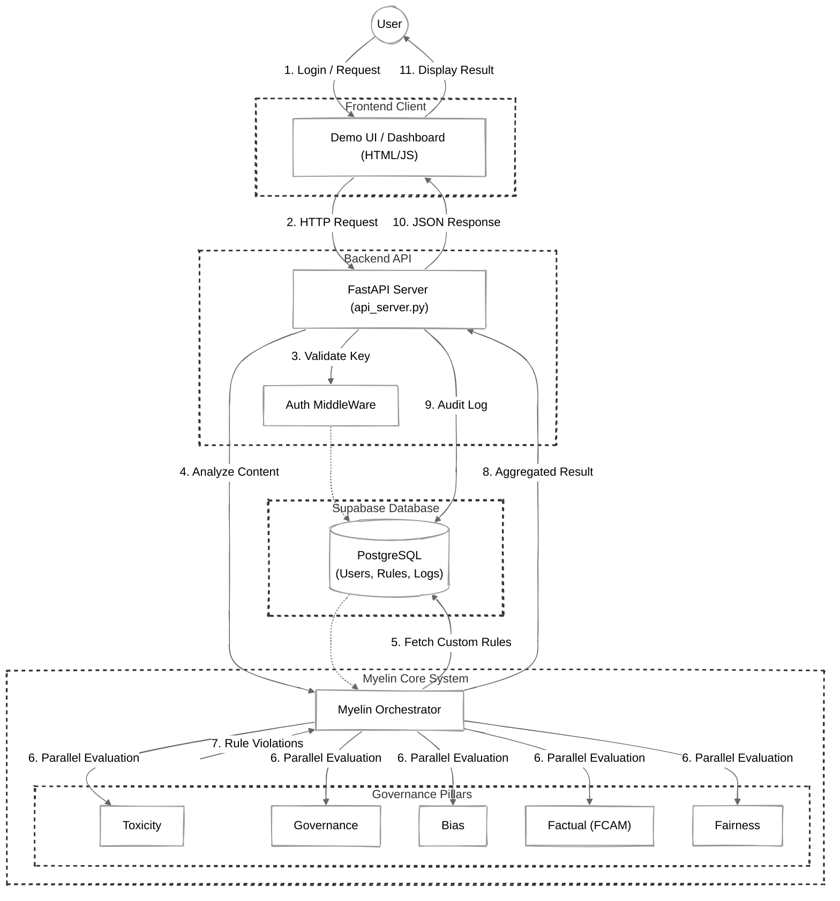

# Myelin Project Flowchart

This flowchart represents the high-level architecture of the Myelin AI Governance project, including the Frontend, Backend API, Orchestrator, Governance Pillars, and the Database (Supabase).

## How to View
This diagram uses the `look: handDrawn` feature of Mermaid.js. 
- **GitHub**: Renders natively in the file viewer.
- **VS Code**: Install "Markdown Preview Mermaid Support" or "Mermaid Editor" to view.
