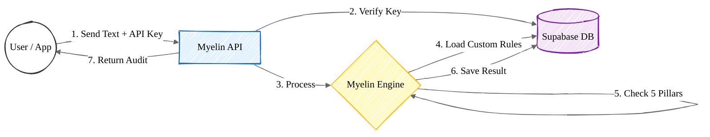

# MYELIN - AI Governance and Alignment Auditor

## 🌟 New Features: Custom Rules Engine & Supabase Backend
**Myelin now includes a complete enterprise-grade backend!**
- **🔐 API Key Authentication**: Secure access with organization-level isolation.
- **🛠️ Custom Rules**: Create and manage your own governance rules (Keyword, Regex, LLM) via API.
- **🏢 Multi-Tenant**: Data isolation for different organizations.
- **📊 Persistent Audit Logs**: All audits are saved to Supabase for historical analysis.
- **🚀 Backward Compatible**: Still works as a standalone tool, but now powers up with a database!

---

## 🎯 Overview

**MYELIN** is a comprehensive AI governance middleware that audits AI-generated content across five critical pillars:

1. **🔍 Fairness** - Ensures equitable outcomes in ML predictions
2. **⚖️ Bias** - Detects gender, racial, religious, and socioeconomic biases
3. **✓ Factual Check (FCAM)** - Validates factual consistency and detects hallucinations
4. **⚠️ Toxicity** - Identifies toxic, harmful, and unsafe content
5. **🛡️ Governance** - Ensures compliance with organizational policies

## 🏗️ Architecture



## 📦 Project Structure

```
myelin_integrated/
├── backend/                         # 🆕 NEW: Complete Backend
│   ├── api/                        # API Endpoints (Auth, Rules, Audit)
│   ├── config/                     # Database & Env Config
│   ├── models/                     # Pydantic Models
│   ├── services/                   # Business Logic
│   ├── api_server_enhanced.py      # 🚀 MAIN SERVER ENTRY POINT
│   └── requirements_backend.txt    # Backend dependencies
│
├── orchestrator/                    # Core Integration Layer
│   ├── myelin_orchestrator.py      
│   └── ...
│
├── Myelin_Fairness_Pillar_RICH_FINAL/   # Fairness Pillar
├── FCAM_fixed/                          # Factual Pillar
├── Toxicity/                            # Toxicity Pillar
├── Governance_Project/                  # Governance Pillar
│
└── frontend/                        # 🎨 Enhanced Frontend
    ├── index.html                  
    └── ...
```

## 🚀 Quick Start

### Prerequisites

- Python 3.8+
- pip
- **Supabase Account** (for custom rules & auth) - *Optional if just running default pillars*

### Installation

1. **Install Backend & Pillar dependencies:**
   ```bash
   # Install backend libs
   pip install -r backend/requirements_backend.txt
   
   # Install orchestrator libs
   pip install -r orchestrator/requirements_api.txt
   
   # Install pillar libs (as needed)
   pip install -r Toxicity/Toxicity/requirements_toxicity.txt
   # ... (see other pillars in detailed docs)
   ```

2. **Configure Environment Variables:**
   Create a `.env` file in the root directory:
   ```env
   SUPABASE_URL=your_supabase_url
   SUPABASE_KEY=your_supabase_anon_key
   JWT_SECRET=your_super_secret_jwt_key
   ```

### Running the Application

**Run the Enhanced API Server (Recommended):**
This starts the server with Auth, Database, and Custom Rules support.

```bash
python backend/api_server_enhanced.py
```

The server will start on `http://localhost:8000`.

- **API Documentation**: http://localhost:8000/docs
- **Frontend Demo**: http://localhost:8000 (served statically)

---

## 🔐 Authentication & Custom Rules

### 1. Register & Get API Key
Use the Frontend (`http://localhost:8000`) or API to register an organization and generate an API Key.

### 2. Add a Custom Rule
You can now add rules that are specific to your organization!

**Example Payload:**
```json
POST /api/v1/rules/custom
Headers: { "X-API-Key": "myelin_sk_..." }
{
  "pillar": "toxicity",
  "name": "No Competitor Mentions",
  "rule_type": "keyword",
  "rule_config": {
    "keywords": ["CompetitorX", "BrandY"]
  }
}
```

### 3. Run an Audit
Send your request with the API Key. Myelin will check **Default Rules** + **Your Custom Rules**.

```bash
curl -X POST "http://localhost:8000/api/v1/audit/conversation" \
  -H "X-API-Key: myelin_sk_..." \
  -d '{
    "user_input": "I hate CompetitorX products!",
    "bot_response": "They are indeed terrible."
  }'
```

## 📚 API Usage

### Python Client Example

```python
from test_client import MyelinClient

# Initialize client
client = MyelinClient("http://localhost:8000")

# Comprehensive conversation audit
result = client.audit_conversation(
    user_input="Tell me about climate change",
    bot_response="Climate change is a serious issue...",
    source_text="Climate change refers to long-term shifts..."
)

print(f"Decision: {result['overall']['decision']}")
print(f"Risk Level: {result['overall']['risk_level']}")
```

### cURL Example

```bash
curl -X POST "http://localhost:8000/api/v1/audit/conversation" \
  -H "Content-Type: application/json" \
  -d '{
    "user_input": "Hello, how are you?",
    "bot_response": "I am doing well, thank you!",
    "source_text": null
  }'
```

### JavaScript/Fetch Example

```javascript
const response = await fetch('http://localhost:8000/api/v1/audit/conversation', {
    method: 'POST',
    headers: { 'Content-Type': 'application/json' },
    body: JSON.stringify({
        user_input: "Your question",
        bot_response: "AI response",
        source_text: "Reference text"
    })
});

const result = await response.json();
console.log(result.overall.decision);
```

## 🔌 API Endpoints

### Comprehensive Audit
- **POST** `/api/v1/audit/conversation` - Run all applicable pillars on a conversation

### Individual Pillars
- **POST** `/api/v1/audit/fairness` - ML model fairness audit
- **POST** `/api/v1/audit/factual` - Factual consistency check
- **POST** `/api/v1/audit/toxicity` - Toxicity detection
- **POST** `/api/v1/audit/governance` - Governance compliance check

### Batch Operations
- **POST** `/api/v1/audit/batch/conversations` - Batch conversation audits

### Utility
- **GET** `/` - API information
- **GET** `/health` - Health check
- **GET** `/docs` - Interactive API documentation
- **GET** `/redoc` - Alternative API documentation

## 📊 Response Format

### Conversation Audit Response

```json
{
  "audit_type": "conversation",
  "timestamp": "2026-01-10T13:06:53.123456",
  "input": {
    "user": "User message",
    "bot": "Bot response",
    "source": "Reference text"
  },
  "pillars": {
    "toxicity": {
      "status": "success",
      "report": {
        "toxicity_score": 0.15,
        "risk_level": "LOW",
        "decision": "ALLOW"
      }
    },
    "governance": { ... },
    "factual": { ... }
  },
  "overall": {
    "risk_score": 0.234,
    "risk_level": "LOW",
    "decision": "ALLOW",
    "risk_factors": []
  }
}
```

## 🎨 Frontend Demo

The enhanced frontend includes:

- **Live API Demo** - Interactive testing of all pillars
- **Real-time Results** - Visual feedback with color-coded risk levels
- **Code Examples** - Integration snippets for developers
- **Responsive Design** - Works on desktop and mobile

### Demo Features

1. **Conversation Audit** - Test comprehensive AI governance
2. **Toxicity Check** - Detect harmful content
3. **Factual Verification** - Check accuracy and hallucinations
4. **Fairness Analysis** - Analyze ML model bias

## 🧪 Testing

### Test via Python Client
```bash
cd orchestrator
python test_client.py
```

### Test Individual Pillars
Refer to the `README` files inside each pillar directory for specific testing instructions.

## 📈 Performance

- **Latency:** ~500ms - 2s per comprehensive audit (depends on pillar complexity)
- **Throughput:** Supports concurrent requests via FastAPI async
- **Scalability:** Can be deployed with multiple workers using Gunicorn/Uvicorn

## 🚢 Deployment

### Docker Deployment
```dockerfile
FROM python:3.9-slim
WORKDIR /app
COPY . /app
RUN pip install -r backend/requirements_backend.txt
# ... install pillar requirements ...
CMD ["python", "backend/api_server_enhanced.py"]
```

## 🛡️ Security Considerations

1. **API Authentication:** Add API key validation for production
2. **Rate Limiting:** Implement rate limiting to prevent abuse
3. **Input Validation:** All inputs are validated via Pydantic models
4. **CORS:** Configure allowed origins in production
5. **HTTPS:** Use HTTPS in production environments

## 📝 License

[Your License Here]

## 👥 Contributors

[Your Team Information]

## 📧 Support

For issues and questions:
- GitHub Issues: [Your Repo]
- Email: [Your Email]
- Documentation: http://localhost:8000/docs

## 🎯 Roadmap

- [ ] Add authentication and API key management
- [ ] Implement caching for improved performance
- [ ] Add support for custom rules via API
- [ ] Create SDKs for popular languages (JavaScript, Java, Go)
- [ ] Add monitoring and analytics dashboard
- [ ] Support for streaming/real-time audits
- [ ] Integration with popular AI platforms (OpenAI, Anthropic, etc.)

## 🙏 Acknowledgments

Built with:
- FastAPI
- Pydantic
- Uvicorn
- And the amazing open-source community

---

**MYELIN** - Making AI Safer, Fairer, and More Accountable 🛡️
